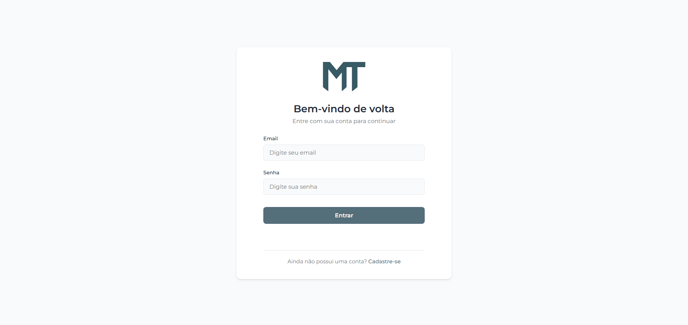
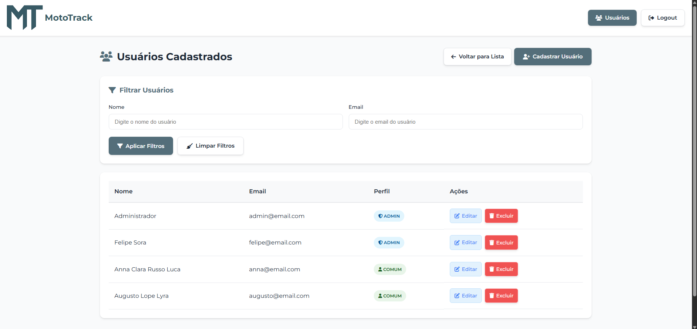
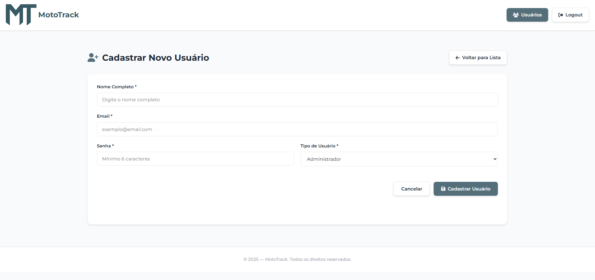
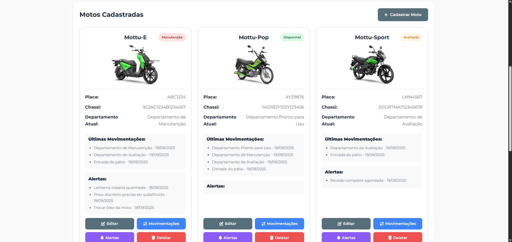
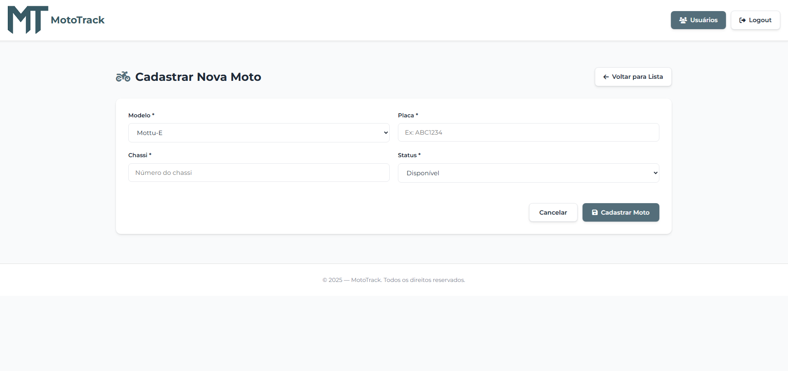
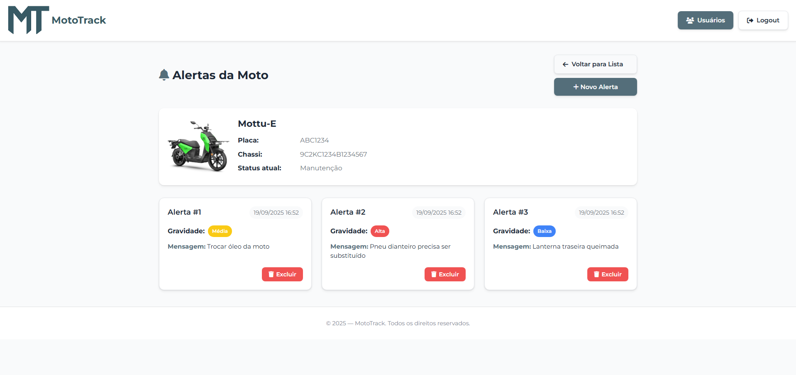

# 🏍️ MotoTrack - Backend API REST (Java)

## 👥 Integrantes

- **Felipe Ulson Sora** – RM555462 – [@felipesora](https://github.com/felipesora)
- **Augusto Lope Lyra** – RM558209 – [@lopeslyra10](https://github.com/lopeslyra10)
- **Vinicius Ribeiro Nery Costa** – RM559165 – [@ViniciusRibeiroNery](https://github.com/ViniciusRibeiroNery)

## 📌 Sumário

- [📝 Descrição da Solução](#-descrição-da-solução)  
- [🗄️ Modelagem do Banco de Dados](#️-modelagem-do-banco-de-dados)  
- [🚀 Como Rodar o Projeto MotoTrack Completo](#-como-rodar-o-projeto-mototrack-completo)  
- [🖥️ Detalhes do Projeto MVC (Java)](#️-detalhes-do-projeto-mvc-java)  
- [🚀 Como Rodar o Projeto MVC (Java)](#-como-rodar-o-projeto-mvc-java)  
- [📹 Demonstração em Vídeo](#-demonstração-em-vídeo)  

## 📝 Descrição da Solução

O **MotoTrack** é um sistema completo desenvolvido para auxiliar empresas de aluguel de motos, como a Mottu, no **controle e monitoramento de sua frota**. 
A aplicação foi criada para resolver problemas comuns de gestão, como a desorganização nos pátios, dificuldade em localizar motos disponíveis ou em manutenção, 
e a falta de histórico rastreável de movimentações e serviços.

O sistema também oferece funcionalidades para **gerenciamento de serviços e manutenções**, vinculando cada atividade a um **colaborador responsável**
, além de permitir o **controle de estoque de peças**, garantindo reposição eficiente e visibilidade dos recursos da empresa.

### O sistema permite:
- 📝 **Cadastro e gestão de motos**;
- 🏢 **Organização por departamentos**, facilitando a localização de veículos;
- 🔄 **Controle de movimentações**, com histórico detalhado;
- 🛠️ **Gestão de serviços e manutenções**, vinculando responsáveis por cada atividade;
- 👨‍🔧 **Registro de colaboradores** envolvidos nos serviços;
- 📦 **Controle de estoque de peças**;
- 🚨 **Disparo de alertas** para acompanhamento do status das motos.

### Estrutura da Solução
O projeto foi dividido em múltiplos módulos para facilitar **escalabilidade e integração**, cada um com responsabilidades específicas:  

- ⚙️ **Backend REST em Java (Spring Boot)** – gerencia as entidades de **usuário, moto, movimentações e alertas**, utilizando **Spring Security com JWT** para autenticação e autorização.  
- 🖥️ **Backend MVC em Java (Spring MVC)** – oferece as mesmas entidades do backend REST Java, com um **frontend web bonito e funcional**, permitindo cadastro, edição, listagem e exclusão de dados diretamente pelo navegador. Possui **Spring Security** com validação de tipo de usuário (**Administrador** e **Comum**) para controlar o acesso às funcionalidades.
- 🧩 **Backend REST em .NET (ASP.NET Core)** – gerencia as entidades de **moto (somente leitura das tabelas criadas pelo Java), colaboradores, serviços e peças**, integrando funcionalidades complementares ao sistema.  
- 📱 **Frontend Mobile (React Native/Expo)** – consome ambas as APIs (Java e .NET) e disponibiliza **telas de cadastro, edição, exclusão e visualização** das funcionalidades, incluindo serviços, colaboradores e estoque de peças.  
- 🗄️ **Banco de Dados Oracle** – utilizado por todos os backends, com **criação automática de tabelas** ao iniciar os projetos.  

---

## 🗄️ Modelagem do Banco de Dados
Abaixo está a modelagem das tabelas utilizadas pelo sistema:  

---

## 🚀 Como Rodar o Projeto MotoTrack Completo

Para utilizar o **MotoTrack** de forma completa, é necessário rodar simultaneamente três módulos:

1. **⚙️ Backend API REST em Java (Spring Boot)** – fornece os endpoints REST para o sistema.
2. **🧩 Backend API REST em .NET (ASP.NET Core)** – fornece funcionalidades complementares via API.
3. **📱 Frontend Mobile (React Native/Expo)** – aplicação mobile que consome ambas as APIs e exibe todas as funcionalidades, incluindo serviços, colaboradores e estoque de peças.
>O **Backend MVC em Java (Spring MVC)** pode ser executado separadamente. Ele permite:
> - **📝 Login e cadastro de usuários;**
> - **🏍️ Cadastro, listagem, edição e exclusão de motos;**
> - **🔄 Cadastro, listagem e exclusão de movimentações e alertas.**

### 🛠️ Passo a Passo

1. Clone todos os repositórios:  
   - [API Rest Java](https://github.com/mototrack-challenge/mototrack-backend-rest-java)  
   - [API Rest .NET](https://github.com/mototrack-challenge/mototrack-backend-rest-dotnet)  
   - [Mobile](https://github.com/mototrack-challenge/mototrack-frontend-mobile)  
   - [MVC Java](https://github.com/mototrack-challenge/mototrack-backend-mvc-java)

2. 🔌 Configure as credenciais de conexão com o banco Oracle nos arquivos de configuração dos backends, se necessário.
    - ✅ O banco de dados e as tabelas serão **criados automaticamente** ao iniciar os backends (Java REST, Java MVC e .NET)

3. 🚀 Rode os backends
    - Java REST: `mvn spring-boot:run` ou rode pelo IDE favorito 
    - .NET REST: `dotnet run` ou abra no Visual Studio

4. 📱 Rode o frontend mobile:
    - Navegue até a pasta do projeto e execute `npm install` para instalar dependências  
    - Execute `npx expo start` para abrir o app no emulador ou dispositivo físico

> ⚠️ Dica: primeiro inicie os backends para que o mobile consiga se conectar às APIs corretamente

5. 🖥️ Para testar o **MVC Java**, basta executar o projeto normalmente; ele funciona isoladamente, sem depender dos outros módulos

---

## 🖥️ Detalhes do Projeto MVC (Java)

O **MotoTrack MVC Java** é o módulo web do sistema, desenvolvido com **Spring MVC**, que permite gerenciar motos, movimentações, alertas e usuários diretamente pelo navegador. Ele foi pensado para fornecer uma **experiência de usuário agradável**, com **interfaces intuitivas e páginas bem estruturadas**.

### 🛠️ Tecnologias e Dependências
O projeto utiliza as seguintes tecnologias e bibliotecas principais:  
- **Java 21**  
- **Spring MVC** – desenvolvimento do backend web e controllers  
- **Spring Security** – autenticação e autorização  
- **Spring Data JPA** – integração com o **Oracle Database**  
- **Thymeleaf** – renderização de páginas HTML   
- **Maven** – gerenciamento de dependências e build do projeto

### 🔐 Segurança e Perfis de Usuário
O projeto possui **Spring Security** implementado, garantindo que apenas usuários autenticados consigam acessar o sistema. Além disso, há **validação por tipo de usuário**:
- **Administrador** – acesso completo a todas as funcionalidades, incluindo:  
  - ✅ Cadastro, edição e exclusão de **usuários**, definindo se serão **Administrador** ou **Comum**  
  - ✅ Cadastro, edição e exclusão de **motos**  
  - ✅ Cadastro, edição e exclusão de **movimentações e alertas**  

- **Usuário Comum** – acesso restrito, podendo apenas:  
  - ✅ Visualizar as **motos cadastradas**  
  - ✅ Criar e deletar **movimentações e alertas** das motos  
  - ❌ Não consegue visualizar ou gerenciar usuários  
  - ❌ Não pode criar, editar ou deletar motos  

> ⚠️ Ao rodar o projeto pela primeira vez, o sistema cria automaticamente um **usuário administrador** para testes:  
> - Email: `admin@email.com`  
> - Senha: `admin123` 

### 📝 Funcionalidades
O MVC permite realizar:
- ✅ **Login e cadastro de usuários**  
- 🏍️ **Cadastro, listagem, edição e exclusão de motos**  
- 🔄 **Cadastro, listagem e exclusão de movimentações**  
- 🚨 **Cadastro, listagem e exclusão de alertas**  
- 📊 **Visualização de histórico de movimentações e status das motos**

### 📸 Exemplos de Telas
1. **Tela de Login**  
   

2. **Tela de Listagem de Usuários**  
   

3. **Tela de Cadastro de Usuários**  
   

4. **Tela de Listagem de Motos**  
   

   

5. **Tela de Cadastro de Moto**  
   

6. **Tela de Movimentações e Alertas**  
     
   

> ⚠️ Todas as telas seguem um padrão visual consistente, facilitando a navegação e tornando o sistema mais agradável para o usuário final.

--- 

## 🚀 Como Rodar o Projeto MVC (Java)

Para executar o **MotoTrack MVC Java**, siga os passos abaixo:

### 1️⃣ Configurar o Banco de Dados
- Abra o arquivo de configuração do banco (por exemplo, `application.properties`) e configure as **credenciais de acesso ao Oracle** (usuário, senha e URL).  
- ✅ O banco e as tabelas serão **criados automaticamente** ao iniciar o projeto, incluindo o usuário admin inicial:
  - Email: `admin@email.com`
  - Senha: `admin123`

### 2️⃣ Verificar Dependências
- Certifique-se de que o **Maven carregou todas as dependências** corretamente.  
- No IntelliJ IDEA, o Maven fará o download automático ao abrir o projeto, mas é recomendado verificar na aba **Maven** se todas as dependências foram resolvidas.

### 3️⃣ Executar o Projeto
- Abra o projeto no **IntelliJ IDEA**.  
- Clique no **ícone de play** na classe principal (`@SpringBootApplication`) para iniciar o servidor.  
- O projeto será iniciado no **localhost:8080**.

### 4️⃣ Acessar a Aplicação
- Abra o navegador e acesse: [http://localhost:8080](http://localhost:8080)

- Você será redirecionado automaticamente para a **tela de login**.

> ⚠️ Dica: Primeiro configure o banco e verifique as dependências do Maven para evitar erros de inicialização.

--- 

## 📹 Demonstração em Vídeo

Para ver o **MotoTrack MVC Java** em funcionamento, assista ao vídeo abaixo, onde o projeto é executado e suas principais funcionalidades são demonstradas:  

🎥 [Assista à demonstração completa](https://www.youtube.com/watch?v=h_PNwJsyep4)  

No vídeo, você verá:  
- Login e cadastro de usuários (admin e comum)  
- Cadastro, edição, listagem e exclusão de motos  
- Cadastro, listagem e exclusão de movimentações e alertas  
- Navegação pelas principais telas e funcionalidades do sistema